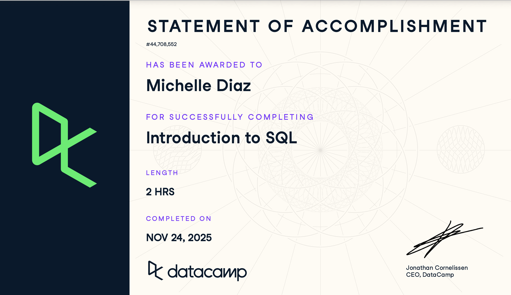

## Course-Completion Evidence

{fig-align="center"}

## Chapter 1: Introduction to Databases and Tables

### Main Ideas

This chapter introduced what a database is and how data is organized within one. SQL is the most widely used programming language for communicating with databases, and databases exist to store large amounts of data in a way that is more powerful and useful than a spreadsheet, since they can hold and handle much more data.

Databases are made up of tables, which are organized into rows and columns. A relational database is made up of several tables that work together, related to one another through shared fields, for example, a book ID column that connects a books table to a checkouts table so that a patron's activity can be linked back to specific books. The advantage of a relational database is that it allows queries to pull together data from across multiple related tables at once. Also, when a database is queried, the underlying data stored inside does not change, only the query itself accesses and displays it.

This chapter also covered choosing a unique identifier (primary key) for each table, naming table fields clearly and consistently, understanding different data types, and getting familiar with how database servers store and manage this information.

### Important SQL Syntax

- Tables: the basic structure for storing data in rows and columns
- Relational database: multiple tables connected to one another through shared fields (e.g., an ID column)
- Unique ID / Primary Key: a column that uniquely identifies each row in a table
- Field naming conventions: consistent, descriptive column names
- Data types: categories such as text, integer, and date that define what kind of value a column can hold
- Database servers: the systems that store and manage tables and respond to queries

### Example

``` sql
-- Example of a simple table structure
SELECT *
FROM customers;
```

### Explanation of the Example

This query selects every column and every row from the customers table, which is a basic way to preview how a table is structured and confirm the data it contains. Running this query does not change the underlying data, it only displays it.

### CEP Application

Understanding how relational databases connect multiple tables is foundational for the CEP, since client data often lives across separate tables, such as customer records, transactions, and survey responses, that need to be linked together through shared IDs. Knowing how to query across these relationships will make it easier to pull the right combined data cleanly when working with a client's database.

## Chapter 2: Querying Data with SQL

### Main Ideas

This chapter covered how to write basic queries to select relevant data from a database. SQL uses keywords, which act like reserved commands, to indicate what operation should happen, such as SELECT and FROM. This chapter focused on using these keywords to pull exactly the data needed, which becomes especially useful when working with large databases.

Key skills covered included selecting multiple fields by separating field names with commas and listing them in a specific order, and selecting all fields at once using an asterisk, also known as a wildcard character. The chapter also covered aliasing, giving a column or table a temporary name to make results easier to read, and using DISTINCT to return only unique records, including using DISTINCT across multiple fields at once to avoid repeated combinations of information.

Another concept covered was views, which let you save a query as something that behaves like a virtual table. A view does not actually store the data itself, it just saves the query so it can be reused, similar to a separate file that displays the result whenever it is accessed.

Finally, this chapter introduced the idea of SQL flavors, different versions of SQL that range from free, open-source systems to major commercial platforms like Microsoft or Oracle. All flavors work within table-based relational databases and share the majority of the same keywords. The two most commonly compared are PostgreSQL, a free and open-source relational database system, and Microsoft SQL Server.

### Important SQL Syntax

- SELECT: chooses which fields to return
- FROM: specifies which table to pull data from
- Selecting multiple fields: separate field names with commas, listed in order
- Wildcard (\*): selects all fields in a table
- Aliasing: temporarily renaming a column or table in the output
- DISTINCT: returns only unique records, can be applied across multiple fields
- Views: saved queries that act like a virtual table without storing the actual data
- SQL flavors: different versions of SQL (e.g., PostgreSQL, Microsoft SQL Server) that share core keywords but differ by platform

### Example

``` sql
SELECT DISTINCT card_number, card_total
FROM transactions;
```

### Explanation of the Example

This query returns only the unique combinations of card_number and card_total from the transactions table, so duplicate rows with the same card number and total are not repeated in the results.

### CEP Application

Being able to select specific fields, remove duplicates with DISTINCT, and save reusable queries as views will be useful for pulling clean, relevant slices of client data for the CEP, especially when working with large datasets like survey responses or transaction records where repeated or irrelevant fields need to be filtered out.

## Overall Reflection and Future Reference

**Most useful skills learned:**

**Most challenging concepts:**

**How SQL could support digital marketing analytics, customer insights, survey research, or the CEP:**

Since digital marketing analytics, survey responses, and customer data are all ultimately stored in databases, SQL is the tool that lets you actually pull the specific information you need out of them rather than working with everything at once. This is especially relevant for survey platforms like Qualtrics, where answer choices are stored behind the scenes as numeric codes, similar to the coding used for questions like involvement level. SQL would make it possible to query that raw exported data directly, for example pulling only the responses where a specific code was selected, rather than manually scrolling through hundreds of rows in a spreadsheet. For the CEP, this means being able to query things like which customer segments engaged with a campaign, filter survey responses down to just the relevant questions or demographics, or pull transaction data tied to a specific time period.

**Concepts or commands I expect to review again in the future:**

I expect to keep coming back to SELECT and the filtering commands like AND and IF, since those are what let you frame a query around exactly the conditions you need. In my previous job at a school district, I used these kinds of conditions regularly, for example pulling records for students and teachers, but narrowing it further to only students who were English learners with a specific entry date. Knowing how to frame multiple conditions together correctly is the part I would want to keep practicing.

## Appendix: Publication Links

- [GitHub Repository](https://github.com/MichelleeeDiazzz/ibm-6500-sql-learning-portfolio)
- [Published Introduction to SQL Report](https://michelleeediazzz.github.io/ibm-6500-sql-learning-portfolio/introduction-to-sql.html)